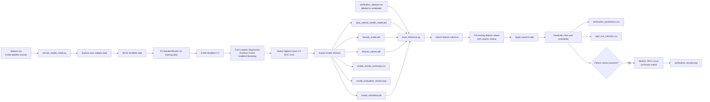
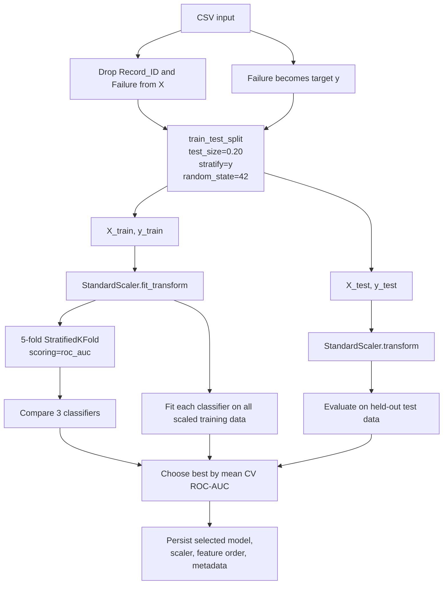
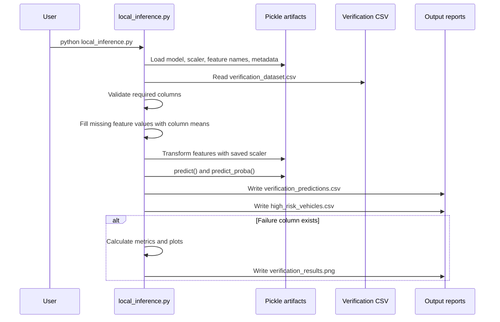
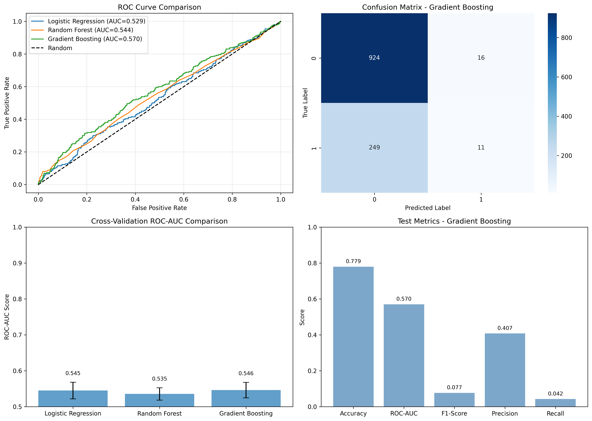

# Vehicle Health Monitoring

An educational predictive-maintenance pipeline that classifies whether a vehicle record indicates a likely failure. The project trains several scikit-learn classifiers in Google Colab, exports the selected model and preprocessing artifacts, and then runs local batch inference against a verification CSV.

> **Important:** This repository is a demonstration and validation workflow, not a safety-critical diagnostic system. The checked-in model currently has limited predictive performance: cross-validation ROC-AUC is **0.5461** and held-out test ROC-AUC is **0.5696**. Treat predictions as experimental signals that require domain review.

## Contents

- [What the project does](#what-the-project-does)
- [Architecture](#architecture)
- [Repository layout](#repository-layout)
- [Dataset and feature contract](#dataset-and-feature-contract)
- [Current model results](#current-model-results)
- [Quick start](#quick-start)
- [Training workflow](#training-workflow)
- [Local inference workflow](#local-inference-workflow)
- [Output files](#output-files)
- [Risk levels and decision thresholds](#risk-levels-and-decision-thresholds)
- [Implementation details](#implementation-details)
- [Reproducibility and compatibility](#reproducibility-and-compatibility)
- [Limitations and recommended improvements](#limitations-and-recommended-improvements)
- [Troubleshooting](#troubleshooting)

## What the project does

The pipeline maps nine numerical vehicle signals to:

1. A binary failure prediction (`0` = no failure, `1` = failure).
2. A failure probability from `predict_proba`.
3. A rule-based risk label (`Low`, `Medium`, `High`, or `Critical`).
4. Optional evaluation metrics when the input CSV includes the known `Failure` label.
5. A CSV report of vehicles above the high-risk threshold.

The repository has two execution modes:

- **Training:** Run `vehicle_health_colab.py` in Google Colab or another Python environment containing the required packages. It reads `dataset.csv`, compares three models, and writes serialized artifacts.
- **Inference:** Run `local_inference.py` locally with the exported artifacts and `verification_dataset.csv`. It produces predictions and, when labels are present, evaluation plots and metrics.

## Architecture

### End-to-end system



### Training data flow



### Inference data flow



## Repository layout

```text
.
├── dataset.csv                    # Labeled training data: 6,000 rows
├── verification_dataset.csv       # Labeled example verification data: 25 rows
├── vehicle_health_colab.py        # Training, comparison, export, and plots
├── local_inference.py             # Batch inference and optional evaluation
├── best_vehicle_health_model.pkl  # Exported selected classifier
├── feature_scaler.pkl             # Fitted sklearn StandardScaler
├── feature_names.pkl              # Ordered list of nine model features
├── model_metadata.pkl             # Model name and saved metrics
├── model_results_summary.csv      # One-row summary of selected model results
├── results/
│   ├── PROJECT_SUMMARY.md         # Earlier project summary
│   └── model_evaluation_results.png
└── README.md
```

The README references only files present in this repository. Older project notes mention files such as `COLAB_SETUP_GUIDE.md`, `QUICK_COLAB_NOTEBOOK.txt`, and `VERIFICATION_DATA_TEMPLATE.csv`; those files are not currently checked in.

## Dataset and feature contract

### Training dataset

`dataset.csv` contains **6,000 rows and 11 columns**:

- `Record_ID`: identifier; excluded from model training.
- Nine numerical sensor/operating features: used as model input.
- `Failure`: binary target; excluded from model input.

Observed training data quality:

| Property | Value |
|---|---:|
| Rows | 6,000 |
| Columns | 11 |
| Failure = 0 | 4,702 |
| Failure = 1 | 1,298 |
| Failure rate | 21.63% |
| Missing values | 0 |
| Duplicate rows | 0 |

### Required model features

The order is persisted in `feature_names.pkl` and must be preserved when preparing new data.

| Feature | Unit / meaning |
|---|---|
| `Engine_Temperature_C` | Engine temperature in degrees Celsius |
| `RPM` | Engine revolutions per minute |
| `Oil_Pressure_psi` | Oil pressure in psi |
| `Vibration_mm_s` | Vibration level in mm/s |
| `Battery_Voltage_V` | Battery voltage in volts |
| `Coolant_Temperature_C` | Coolant temperature in degrees Celsius |
| `Fuel_Consumption_L_100km` | Fuel consumption in litres per 100 km |
| `Vehicle_Speed_kmh` | Vehicle speed in km/h |
| `Operating_Hours` | Total operating hours |

### Verification CSV format

The minimum unlabeled format is:

```csv
Record_ID,Engine_Temperature_C,RPM,Oil_Pressure_psi,Vibration_mm_s,Battery_Voltage_V,Coolant_Temperature_C,Fuel_Consumption_L_100km,Vehicle_Speed_kmh,Operating_Hours
1001,92.5,1450,55.2,2.3,13.1,88.0,9.5,45.0,2500.0
```

Adding `Failure` enables accuracy, precision, recall, F1, ROC-AUC, a classification report, a confusion matrix, and plots:

```csv
Record_ID,Engine_Temperature_C,RPM,Oil_Pressure_psi,Vibration_mm_s,Battery_Voltage_V,Coolant_Temperature_C,Fuel_Consumption_L_100km,Vehicle_Speed_kmh,Operating_Hours,Failure
1001,92.5,1450,55.2,2.3,13.1,88.0,9.5,45.0,2500.0,0
```

The checked-in `verification_dataset.csv` contains 25 labeled examples: 16 non-failures and 9 failures. It is a small demonstration set, not an independent production validation set.

## Current model results

The checked-in metadata and `model_results_summary.csv` report the following results:

| Model selected | CV ROC-AUC mean | CV standard deviation | Test accuracy | Test ROC-AUC | Test F1 | Test precision | Test recall |
|---|---:|---:|---:|---:|---:|---:|---:|
| Gradient Boosting | 0.5461 | 0.0216 | 0.7792 | 0.5696 | 0.0767 | 0.4074 | 0.0423 |

The selected model is **Gradient Boosting** because the training script chooses the highest mean five-fold CV ROC-AUC. This selection rule does not mean the model is production-ready. In particular, the recorded recall of **0.0423** means that the exported classifier detected only a small fraction of positive failures at its default classification threshold on the held-out test set.

### Evaluation visualization

The following figure is generated by `vehicle_health_colab.py` and is stored at [`results/model_evaluation_results.png`](results/model_evaluation_results.png).



The four panels should be read as follows:

1. **ROC curve comparison — top left:** The three curves compare the models across classification thresholds. A curve close to the dashed diagonal is near random ranking. Gradient Boosting has the highest displayed test ROC-AUC (`0.570`), but it is only modestly better than random.
2. **Confusion matrix — top right:** On the held-out test set, the selected Gradient Boosting model produced:
   - `924` true negatives: correctly identified non-failures.
   - `16` false positives: non-failures incorrectly flagged as failures.
   - `249` false negatives: actual failures missed by the model.
   - `11` true positives: failures correctly detected.

   The `249` false negatives versus only `11` true positives explains the very low recall (`0.0423`). For predictive maintenance, this is a serious limitation because missed failures may be more costly than unnecessary inspections.
3. **Cross-validation ROC-AUC comparison — bottom left:** The five-fold means are approximately `0.545` for Logistic Regression, `0.535` for Random Forest, and `0.546` for Gradient Boosting. The error bars show fold-to-fold variation. Gradient Boosting was selected because it had the highest mean, although the differences are small.
4. **Selected-model test metrics — bottom right:** The test accuracy is `0.779`, but accuracy is misleading here because the dataset is imbalanced and the model predicts very few failures. ROC-AUC (`0.570`), F1 (`0.077`), precision (`0.407`), and especially recall (`0.042`) provide a more useful view of the model's current limitations.

This image is a diagnostic summary of the current training run, not evidence that the system is ready for unattended maintenance decisions. Retraining, label review, threshold tuning, and independent validation are recommended before operational use.

## Quick start

### 1. Create an environment

Python 3.10 or 3.11 is recommended for compatibility with the serialized scikit-learn artifacts. Install the packages used by the scripts:

```bash
python -m venv .venv

# Windows PowerShell
.venv\Scripts\Activate.ps1

# macOS/Linux
# source .venv/bin/activate

python -m pip install --upgrade pip
python -m pip install pandas numpy scikit-learn matplotlib seaborn
```

### 2. Run local inference with the checked-in artifacts

Run from the repository root because `local_inference.py` uses relative file names:

```bash
python local_inference.py
```

The script reads:

- `best_vehicle_health_model.pkl`
- `feature_scaler.pkl`
- `feature_names.pkl`
- `model_metadata.pkl` (optional for execution, used for comparison output)
- `verification_dataset.csv`

It writes output files to the current working directory. Existing output files with the same names are overwritten.

### 3. Train or retrain the model

For cloud training:

1. Open [Google Colab](https://colab.research.google.com/).
2. Upload `dataset.csv` and `vehicle_health_colab.py`.
3. Run the script from the directory containing `dataset.csv`.
4. Download the generated artifacts listed in [Output files](#output-files).
5. Place the artifacts beside `local_inference.py` for local verification.

The training script can also be run locally after installing the dependencies:

```bash
python vehicle_health_colab.py
```

The script uses plotting calls that may open an interactive window. In a headless environment, use a non-interactive Matplotlib backend if required by your environment.

## Training workflow

`vehicle_health_colab.py` performs these steps:

1. Loads `dataset.csv`.
2. Prints shape, sample rows, schema, summary statistics, target distribution, missing-value count, and duplicate count.
3. Drops `Record_ID` and separates `Failure` into `X` and `y`.
4. Creates an 80/20 stratified train/test split with `random_state=42`.
5. Fits `StandardScaler` on `X_train` only and transforms both train and test data.
6. Creates a shuffled five-fold `StratifiedKFold` with `random_state=42`.
7. Compares:
   - `LogisticRegression(max_iter=1000, random_state=42)`
   - `RandomForestClassifier(n_estimators=100, random_state=42, n_jobs=-1)`
   - `GradientBoostingClassifier(n_estimators=100, random_state=42)`
8. Scores each model with cross-validation ROC-AUC.
9. Fits each model on all scaled training data and calculates train/test metrics.
10. Selects the model with the highest mean CV ROC-AUC.
11. Exports the selected model, preprocessing artifacts, metrics, and plots.

### Important preprocessing detail

The scaler is fitted only on training rows:

```python
scaler = StandardScaler()
X_train_scaled = scaler.fit_transform(X_train)
X_test_scaled = scaler.transform(X_test)
```

New inference data must use `scaler.transform(...)`; fitting a new scaler would change the feature representation expected by the model.

## Local inference workflow

`local_inference.py`:

1. Loads the model, scaler, feature order, and metadata with `pickle`.
2. Reads `verification_dataset.csv`.
3. Checks whether `Failure` is present.
4. Selects columns using the persisted feature order.
5. Fills missing feature values with the corresponding verification-column mean.
6. Applies the saved scaler.
7. Calls `predict()` and `predict_proba()[:, 1]`.
8. Adds:
   - `Predicted_Failure`
   - `Failure_Probability`
   - `Risk_Level`
9. Saves all predictions.
10. If labels exist, calculates evaluation metrics and writes visualizations.
11. Filters rows with probability greater than `0.5` into the high-risk report.

### Example programmatic loading

```python
import pickle
import pandas as pd

with open("best_vehicle_health_model.pkl", "rb") as file:
    model = pickle.load(file)

with open("feature_scaler.pkl", "rb") as file:
    scaler = pickle.load(file)

with open("feature_names.pkl", "rb") as file:
    feature_names = pickle.load(file)

df = pd.read_csv("verification_dataset.csv")
X = scaler.transform(df[feature_names])
failure_probability = model.predict_proba(X)[:, 1]
```

## Output files

| File | Produced by | Description |
|---|---|---|
| `best_vehicle_health_model.pkl` | Training | Selected fitted classifier |
| `feature_scaler.pkl` | Training | `StandardScaler` fitted on training features |
| `feature_names.pkl` | Training | Ordered list of model input columns |
| `model_metadata.pkl` | Training | Model name, feature names, CV metrics, and test metrics |
| `model_results_summary.csv` | Training | One-row summary for the selected model |
| `model_evaluation_results.png` | Training | Training/test comparison plots |
| `verification_predictions.csv` | Inference | Original verification rows plus predictions and risk |
| `verification_results.png` | Inference with labels | ROC curve, confusion matrix, probability distribution, and metrics |
| `high_risk_vehicles.csv` | Inference | Rows with failure probability greater than 0.5 |

## Risk levels and decision thresholds

Risk labels are assigned from the predicted failure probability:

| Probability | Label |
|---:|---|
| `> 0.70` | Critical |
| `> 0.50` | High |
| `> 0.30` | Medium |
| `<= 0.30` | Low |

The classifier's binary `predict()` output is separate from these labels. The high-risk report uses `Failure_Probability > 0.5`, while `predict()` uses the estimator's own default decision threshold.

These cutoffs are illustrative and have not been calibrated against maintenance costs, downtime, or safety requirements. A real deployment should choose thresholds using validation data and an explicit false-negative/false-positive cost trade-off.

## Implementation details

### Evaluation metrics

- **Accuracy:** fraction of all predictions that are correct.
- **Precision:** fraction of predicted failures that are actual failures.
- **Recall:** fraction of actual failures detected.
- **F1:** harmonic mean of precision and recall.
- **ROC-AUC:** ranking quality across probability thresholds; `0.5` is approximately random ranking.

For this imbalanced target, ROC-AUC and recall are more informative than accuracy alone. The current low recall is a material limitation.

### Missing data behavior

Training reports missing values but does not impute them before fitting. Inference fills missing values with the mean of each verification input column. This is a simple fallback and is not guaranteed to match a robust production data-quality policy.

### Artifact security

The artifacts use Python pickle. Never load pickle files from an untrusted source: unpickling can execute arbitrary Python code. For deployment, store artifacts in a trusted location and consider a safer, versioned model-serialization strategy.

## Reproducibility and compatibility

- The split and cross-validation use `random_state=42`.
- Model selection is based on mean five-fold CV ROC-AUC.
- The saved model expects the nine feature columns in `feature_names.pkl`.
- Serialized scikit-learn and NumPy artifacts are version-sensitive. Use a compatible Python, NumPy, and scikit-learn environment when loading the checked-in `.pkl` files.
- Retraining is preferred when dependencies have changed materially or when the input schema changes.
- The scripts use relative paths; run them from the repository root or update the constants at the top of the script.

## Limitations and recommended improvements

The current project should be improved before any operational use:

1. **Investigate data signal and labels.** The current CV ROC-AUC is only slightly above random, and test recall is very low.
2. **Use a leakage-safe pipeline.** Wrap scaling and the estimator in an sklearn `Pipeline` so preprocessing is applied consistently inside every cross-validation fold.
3. **Tune for the actual objective.** Evaluate PR-AUC, recall at an acceptable alert volume, calibration, and cost-weighted metrics.
4. **Tune the decision threshold.** Do not assume `0.5` is appropriate for maintenance triage.
5. **Add a real validation protocol.** Use a time-based split if records represent a temporal fleet history, and keep a final untouched test set.
6. **Improve data validation.** Enforce numeric types, required columns, finite values, valid ranges, and target values of only `0` or `1`.
7. **Track versions.** Record training date, dependency versions, dataset hash, and model version in metadata.
8. **Add tests and CI.** Test schema validation, artifact loading, prediction shape, probability bounds, and output generation.
9. **Add explainability carefully.** Feature importance or SHAP analysis should be validated and presented as association, not causal diagnosis.
10. **Monitor in production.** Track drift, missingness, alert rates, false negatives, and confirmed maintenance outcomes.

## Troubleshooting

### `FileNotFoundError`

Run the command from the repository root and confirm that the four required artifacts plus `verification_dataset.csv` are present:

```bash
python local_inference.py
```

### Feature mismatch or `KeyError`

The verification CSV must contain all nine names from `feature_names.pkl`. `Record_ID` and `Failure` are not model features, but `Failure` may be included for evaluation.

### Pickle or NumPy/scikit-learn compatibility error

Install compatible dependency versions in a clean environment or retrain the model with the versions currently installed. Do not load an untrusted pickle file.

### Too many alerts or too few detected failures

Review the probability distribution and select a threshold using a labeled validation set. Changing a threshold changes the operational trade-off; it does not improve the underlying model ranking.

### Verification results differ from training results

Check feature names and units, feature distributions, missing-value handling, dependency versions, and whether the verification data is representative. The checked-in verification file is only 25 rows, so its metrics can vary substantially.

## License and usage

No explicit open-source license is included in this repository. Treat the code and artifacts as project-owned unless the repository owner provides separate licensing terms. Do not use the predictions as the sole basis for safety-critical or legally consequential maintenance decisions.
